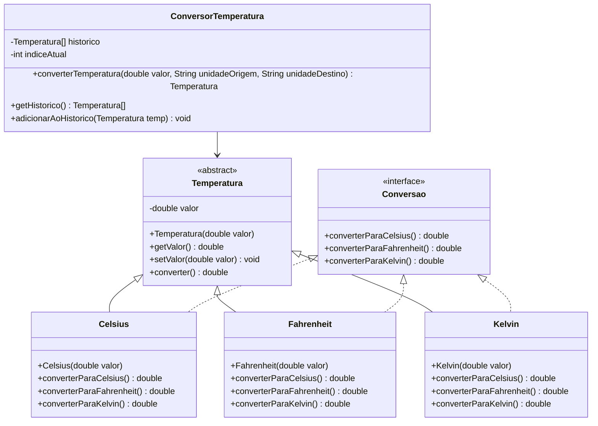

# Projeto Prático II-A: Conversor de Temperatura Orientado a Objetos

## Objetivo
Praticar conceitos de Programação Orientada a Objetos (POO) em Java, incluindo Classes, Objetos, Atributos, Métodos, Construtores, Encapsulamento, Herança, Polimorfismo, Classe Abstrata, Interface e Sobrecarga de Métodos.

## Descrição
Desenvolver uma aplicação console que:
- Converta temperaturas entre Celsius, Fahrenheit e Kelvin utilizando classes específicas para cada unidade
- Armazene as últimas 5 temperaturas convertidas em um vetor de objetos
- Exiba o histórico de conversões
- Utilize herança, polimorfismo, interface, classe abstrata e sobrecarga de métodos para as conversões

## Funcionalidades
1. **Estrutura de Classes**:
   - Criar uma **classe abstrata** `Temperatura` com atributos e métodos comuns
   - Implementar **subclasses** para Celsius, Fahrenheit e Kelvin, cada uma com métodos de conversão específicos
   - Utilizar **encapsulamento** para proteger os atributos
   - Utilizar **construtores** para inicializar os objetos
   - Definir uma **interface** `Conversao` com métodos para conversão de temperatura, que será implementada pelas subclasses
   - Implementar **sobrecarga de métodos** para conversão, permitindo diferentes assinaturas (por exemplo, converter passando apenas valor, ou valor e precisão)

2. **Entrada de Dados**:
   - Receber valor numérico e unidade atual
   - Criar objeto correspondente e adicionar ao histórico (vetor)

3. **Seleção de Conversão**:
   - Escolher para qual unidade converter
   - Utilizar polimorfismo e interface para realizar a conversão

4. **Histórico e Exibição**:
   - Mostrar últimas conversões do vetor de objetos

## Exemplo de Uso
```
=== CONVERSOR DE TEMPERATURA (POO) ===
1. Converter temperatura
2. Ver histórico
3. Ver estatísticas
4. Sair
Escolha uma opção: 1

[CONVERSÃO]
Digite a temperatura: 25
Unidade atual (C/F/K): C
Converter para (C/F/K): F
Resultado: 77°F

=== CONVERSOR DE TEMPERATURA (POO) ===
1. Converter temperatura
2. Ver histórico
3. Ver estatísticas
4. Sair
Escolha uma opção: 2

[HISTÓRICO]
1. 25.00°C -> 77.00°F
2. 37.00°C -> 310.15K

=== CONVERSOR DE TEMPERATURA (POO) ===
1. Converter temperatura
2. Ver histórico
3. Ver estatísticas
4. Sair
Escolha uma opção: 4
Programa finalizado!
```

## Observações
- A lista armazena apenas as últimas 5 conversões realizadas (objetos de conversão)
- Os valores podem ser armazenados como objetos da classe base `Temperatura`
- Precisão de duas casas decimais nas conversões
- Utilize todos os conceitos de POO: Classes, Objetos, Atributos, Métodos, Construtores, Herança, Polimorfismo, Encapsulamento, Interface, Classe Abstrata e Sobrecarga de Métodos

## Diagrama UML



O diagrama acima representa:
- `Temperatura`: Classe abstrata base com atributos e métodos comuns
- `Conversao`: Interface que define os métodos de conversão
- Classes concretas: `Celsius`, `Fahrenheit` e `Kelvin` que herdam de `Temperatura` e implementam `Conversao`
- `ConversorTemperatura`: Classe principal que gerencia as conversões e o histórico usando um vetor de tamanho fixo
