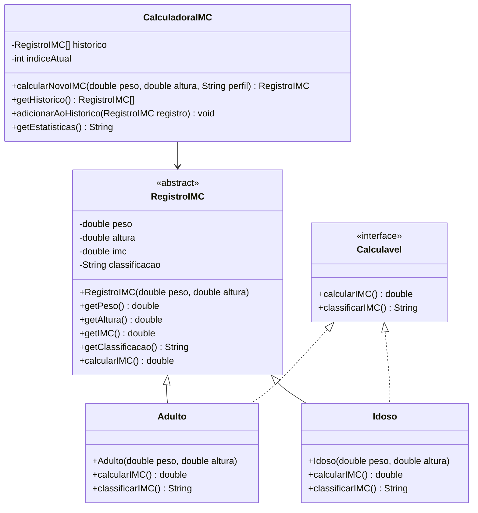

# Projeto Prático II-B: Calculadora de IMC Orientada a Objetos

## Objetivo
Praticar conceitos de Programação Orientada a Objetos (POO) em Java, incluindo Classes, Objetos, Atributos, Métodos, Construtores, Encapsulamento, Herança, Polimorfismo, Classe Abstrata, Interface e Sobrecarga de Métodos.

## Descrição
Desenvolver uma aplicação console que:
- Calcule o IMC de várias pessoas utilizando classes específicas
- Armazene os dados das últimas 10 pessoas em um vetor de objetos
- Mostre resultados sequencialmente e exiba histórico e estatísticas
- Utilize herança, polimorfismo, interface, classe abstrata e sobrecarga de métodos para os cálculos e classificações

## Funcionalidades
1. **Estrutura de Classes**:
   - Criar uma **classe abstrata** `RegistroIMC` com atributos e métodos comuns (peso, altura, IMC, classificação)
   - Implementar **subclasses** para diferentes perfis (ex: Adulto, Idoso), cada uma podendo ter regras de classificação específicas
   - Utilizar **encapsulamento** para proteger os atributos
   - Utilizar **construtores** para inicializar os objetos
   - Definir uma **interface** `Calculavel` com métodos para cálculo e classificação do IMC, que será implementada pelas subclasses
   - Implementar **sobrecarga de métodos** para cálculo do IMC (por exemplo, calcular apenas com peso/altura, ou com precisão desejada)

2. **Entrada de Dados**:
   - Receber peso e altura do usuário
   - Criar objeto correspondente e adicionar ao vetor de histórico

3. **Cálculo e Exibição**:
   - Calcular IMC e classificação utilizando polimorfismo e interface
   - Exibir resultado formatado

4. **Histórico e Estatísticas**:
   - Mostrar histórico das últimas 10 pessoas (objetos de IMC)
   - Exibir estatísticas: total de registros, menor IMC, maior IMC, média

## Exemplo de uso
```
=== CALCULADORA DE IMC (POO) ===
1. Calcular novo IMC
2. Mostrar histórico
3. Ver estatísticas
4. Sair
Escolha uma opção: 1

[CÁLCULO DE IMC]
Digite o peso (kg): 70
Digite a altura (m): 1.75
Perfil (A)dulto/(I)doso: A

Resultado:
IMC: 22.86
Classificação: Peso Normal

=== CALCULADORA DE IMC (POO) ===
1. Calcular novo IMC
2. Mostrar histórico
3. Ver estatísticas
4. Sair
Escolha uma opção: 2

[HISTÓRICO]
1. IMC: 22.86 (Normal) - Adulto
2. IMC: 29.38 (Sobrepeso) - Idoso

=== CALCULADORA DE IMC (POO) ===
1. Calcular novo IMC
2. Mostrar histórico
3. Ver estatísticas
4. Sair
Escolha uma opção: 3

[ESTATÍSTICAS]
Total de registros: 2
Menor IMC: 22.86
Maior IMC: 29.38
Média: 26.12

=== CALCULADORA DE IMC (POO) ===
1. Calcular novo IMC
2. Mostrar histórico
3. Ver estatísticas
4. Sair
Escolha uma opção: 4
Programa finalizado!
```

## Observações
- O vetor armazena apenas os últimos 10 registros de IMC (objetos)
- Os valores são armazenados como objetos da classe base `RegistroIMC`
- Precisão de duas casas decimais nos cálculos
- Utilize todos os conceitos de POO: Classes, Objetos, Atributos, Métodos, Construtores, Herança, Polimorfismo, Encapsulamento, Interface, Classe Abstrata e Sobrecarga de Métodos

## Diagrama UML

> **Sugestão:** O diagrama UML abaixo é apenas uma sugestão de implementação. Você pode estruturar suas classes de outra forma, desde que todos os requisitos do projeto sejam atendidos.



## Explicação do diagrama
O diagrama acima representa:
- `RegistroIMC`: Classe abstrata base com atributos e métodos comuns
- `Calculavel`: Interface que define os métodos de cálculo e classificação
- Classes concretas: `Adulto` e `Idoso` que herdam de `RegistroIMC` e implementam `Calculavel`
- `CalculadoraIMC`: Classe principal que gerencia os cálculos e o histórico usando um vetor de tamanho fixo

## Critérios de Avaliação
| Critério                               | Pontos |
|---------------------------------------|--------|
| **Funcionalidade (2.5)**              |        |
| - Implementação dos requisitos        | 1.0    |
| - Correto uso do array               | 1.0    |
| - Precisão nos cálculos              | 0.5    |
| **Qualidade do Código (1.5)**         |        |
| - Organização e clareza              | 0.5    |
| - Comentários e documentação         | 0.5    |
| - Tratamento de erros               | 0.5    |
| **Interface e Usabilidade (1.0)**     |        |
| - Clareza nas mensagens             | 1.0    |
| **Apresentação (5.0)**                |        |
| - Domínio do código                 | 2.0    |
| - Explicação da lógica              | 2.0    |
| - Respostas às perguntas            | 1.0    |
| **Total**                             | 10.0   |

### Observações da Avaliação
- Nota mínima para aprovação: 5.0 pontos
- Trabalhos não apresentados recebem nota zero
- Leitura durante apresentação recebe nota zero
- Membros ausentes recebem nota zero
- Códigos que não executam recebem nota zero
- Cada membro deve apresentar
- A nota da apresentação será individual
- Demonstração prática obrigatória

## Instruções de Entrega
1. **Email**:
   - Para: matheusluis103@gmail.com
   - Assunto: "ETB-LTP1-ProjetoA2-[TURMA][GRUPO]"
   - Até: 30/05, 14:00
   - O remetente do email deve copiar (CC) todos os demais integrantes do grupo.

2. **Conteúdo**:
   - Códigos fonte (.java)
   - Nomes dos integrantes
