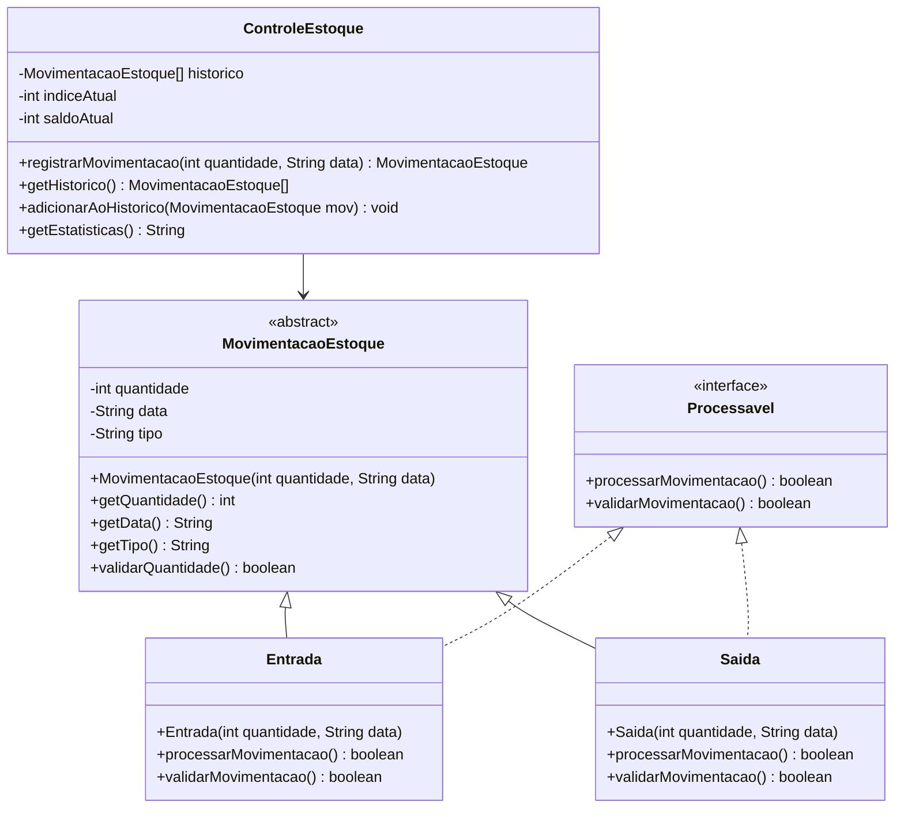

# Projeto Prático II-C: Sistema de Controle de Estoque Orientado a Objetos

## Objetivo
Praticar conceitos de Programação Orientada a Objetos (POO) em Java, incluindo Classes, Objetos, Atributos, Métodos, Construtores, Encapsulamento, Herança, Polimorfismo, Classe Abstrata, Interface e Sobrecarga de Métodos.

## Descrição
Implementar um sistema que:
- Gerencie o estoque de um único produto usando classes e objetos
- Registre as últimas 10 movimentações de estoque em um vetor de objetos
- Permita entradas e saídas do estoque
- Mostre histórico de movimentações e estatísticas
- Utilize herança, polimorfismo, interface, classe abstrata e sobrecarga de métodos para as movimentações e cálculos

## Funcionalidades
1. **Estrutura de Classes**:
   - Criar uma **classe abstrata** `MovimentacaoEstoque` com atributos e métodos comuns (quantidade, data, tipo)
   - Implementar **subclasses** para diferentes tipos de movimentação (Entrada, Saída), cada uma com regras específicas de validação
   - Utilizar **encapsulamento** para proteger os atributos
   - Utilizar **construtores** para inicializar os objetos
   - Definir uma **interface** `Processavel` com métodos para processar movimentações, que será implementada pelas subclasses
   - Implementar **sobrecarga de métodos** para registrar movimentação (ex: registrar apenas quantidade, ou quantidade e data)

2. **Entrada de Dados**:
   - Registrar nova movimentação (positivo para entrada, negativo para saída)
   - Criar objeto correspondente e adicionar ao vetor de histórico

3. **Processamento**:
   - Atualizar saldo do estoque usando métodos das classes
   - Validar quantidade mínima (0) e máxima (999)
   - Calcular média de movimentações

4. **Exibição**:
   - Mostrar histórico de movimentações (objetos)
   - Exibir saldo atual
   - Apresentar estatísticas

## Exemplo de Uso
```
=== CONTROLE DE ESTOQUE (POO) ===
1. Registrar movimentação
2. Ver histórico
3. Ver estatísticas
4. Sair
Escolha uma opção: 1

[MOVIMENTAÇÃO]
Digite a quantidade (+/-): 50
Movimentação registrada!
Saldo atual: 50 unidades

=== CONTROLE DE ESTOQUE (POO) ===
1. Registrar movimentação
2. Ver histórico
3. Ver estatísticas
4. Sair
Escolha uma opção: 1

[MOVIMENTAÇÃO]
Digite a quantidade (+/-): -20
Movimentação registrada!
Saldo atual: 30 unidades

=== CONTROLE DE ESTOQUE (POO) ===
1. Registrar movimentação
2. Ver histórico
3. Ver estatísticas
4. Sair
Escolha uma opção: 2

[HISTÓRICO]
1. +50 unidades (Entrada)
2. -20 unidades (Saída)
Saldo atual: 30 unidades

=== CONTROLE DE ESTOQUE (POO) ===
1. Registrar movimentação
2. Ver histórico
3. Ver estatísticas
4. Sair
Escolha uma opção: 3

[ESTATÍSTICAS]
Total movimentações: 2
Maior entrada: 50
Maior saída: 20
Média movimentações: 15
Saldo atual: 30

=== CONTROLE DE ESTOQUE (POO) ===
1. Registrar movimentação
2. Ver histórico
3. Ver estatísticas
4. Sair
Escolha uma opção: 4
Programa finalizado!
```

## Observações
- O vetor armazena apenas as últimas 10 movimentações (objetos)
- Os valores são armazenados como objetos da classe base `MovimentacaoEstoque`
- Saldo não pode ficar negativo
- Validar todas as entradas
- Armazenar apenas valores inteiros
- Utilize todos os conceitos de POO: Classes, Objetos, Atributos, Métodos, Construtores, Herança, Polimorfismo, Encapsulamento, Interface, Classe Abstrata e Sobrecarga de Métodos

## Critérios de Avaliação
| Critério                               | Pontos |
|---------------------------------------|--------|
| **Funcionalidade (2.5)**              |        |
| - Implementação dos requisitos        | 1.0    |
| - Correto uso do array               | 1.0    |
| - Precisão nos cálculos              | 0.5    |
| **Qualidade do Código (1.5)**         |        |
| - Organização e clareza              | 0.5    |
| - Comentários e documentação         | 0.5    |
| - Tratamento de erros               | 0.5    |
| **Interface e Usabilidade (1.0)**     |        |
| - Clareza nas mensagens             | 1.0    |
| **Apresentação (5.0)**                |        |
| - Domínio do código                 | 2.0    |
| - Explicação da lógica              | 2.0    |
| - Respostas às perguntas            | 1.0    |
| **Total**                             | 10.0   |

### Observações da Avaliação
- Nota mínima para aprovação: 5.0 pontos
- Trabalhos não apresentados recebem nota zero
- Leitura durante apresentação recebe nota zero
- Membros ausentes recebem nota zero
- Códigos que não executam recebem nota zero
- Cada membro deve apresentar
- A nota da apresentação será individual
- Demonstração prática obrigatória

## Instruções de Entrega
1. **Email**:
   - Para: matheusluis103@gmail.com
   - Assunto: "ETB-LTP1-ProjetoA2-[TURMA][GRUPO]"
   - Até: 30/05, 14:00

2. **Conteúdo**:
   - Códigos fonte (.java)
   - Nomes dos integrantes

## Diagrama UML


O diagrama acima representa:
- `MovimentacaoEstoque`: Classe abstrata base com atributos e métodos comuns
- `Processavel`: Interface que define os métodos de processamento e validação
- Classes concretas: `Entrada` e `Saida` que herdam de `MovimentacaoEstoque` e implementam `Processavel`
- `ControleEstoque`: Classe principal que gerencia as movimentações e o histórico usando um vetor de tamanho fixo
