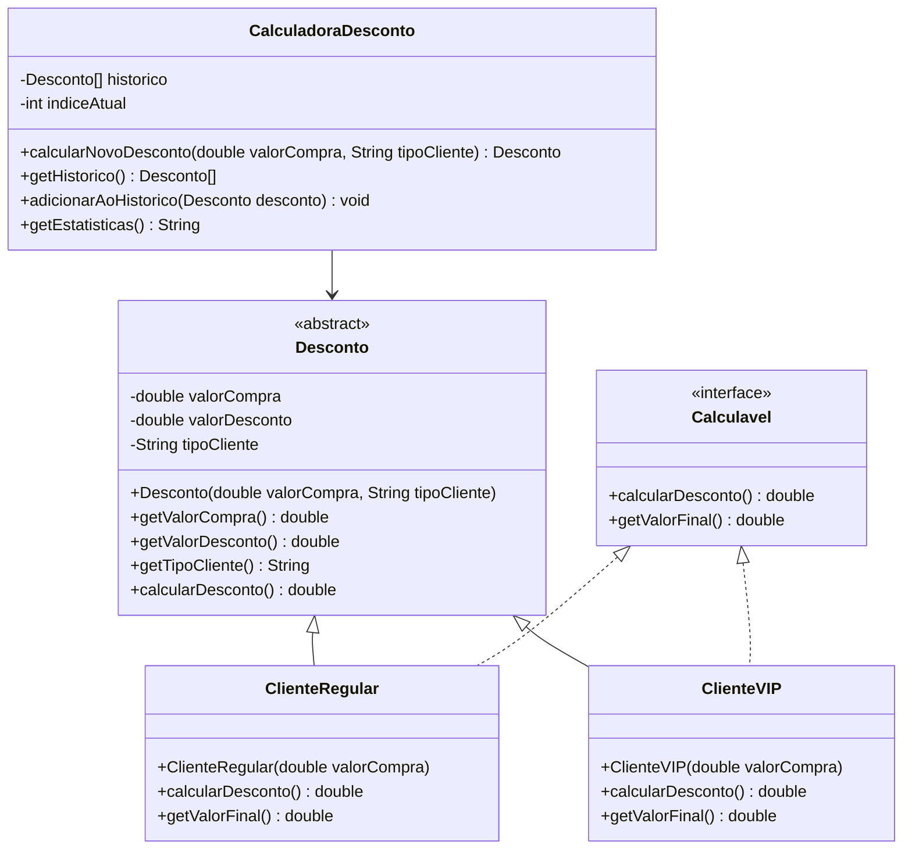

# Projeto Prático II-D: Calculadora de Descontos Orientada a Objetos

## Objetivo
Praticar conceitos de Programação Orientada a Objetos (POO) em Java, incluindo Classes, Objetos, Atributos, Métodos, Construtores, Encapsulamento, Herança, Polimorfismo, Classe Abstrata, Interface e Sobrecarga de Métodos.

## Descrição
Desenvolver uma aplicação que:
- Use um vetor de objetos para armazenar os últimos descontos aplicados
- Calcule descontos baseados no valor da compra e tipo de cliente usando classes e objetos
- Mantenha histórico das últimas 10 operações
- Exiba estatísticas dos descontos
- Utilize herança, polimorfismo, interface, classe abstrata e sobrecarga de métodos para os cálculos

## Funcionalidades
1. **Estrutura de Classes**:
   - Criar uma **classe abstrata** `Desconto` com atributos e métodos comuns (valorCompra, desconto, tipoCliente)
   - Implementar **subclasses** para diferentes tipos de cliente (Regular, VIP), cada uma com regras de desconto específicas
   - Utilizar **encapsulamento** para proteger os atributos
   - Utilizar **construtores** para inicializar os objetos
   - Definir uma **interface** `Calculavel` com métodos para calcular desconto, que será implementada pelas subclasses
   - Implementar **sobrecarga de métodos** para cálculo do desconto (ex: calcular apenas com valor, ou valor e tipo)

2. **Entrada de Dados**:
   - Valor da compra
   - Tipo de cliente (Regular/VIP)
   - Criar objeto correspondente e adicionar ao vetor de histórico

3. **Processamento**:
   - Calcular valor do desconto e valor final usando métodos das classes
   - Armazenar no histórico

4. **Exibição**:
   - Mostrar resultado atual
   - Exibir histórico de descontos (objetos)
   - Apresentar estatísticas

## Exemplo de Uso
```
=== CALCULADORA DE DESCONTOS (POO) ===
1. Calcular desconto
2. Ver histórico
3. Ver estatísticas
4. Sair
Escolha uma opção: 1

[NOVA COMPRA]
Valor da compra: 100.00
Tipo de cliente (R/V): V

[RESULTADO]
Valor original: R$ 100.00
Desconto (10%): R$ 10.00
Valor final: R$ 90.00

=== CALCULADORA DE DESCONTOS (POO) ===
1. Calcular desconto
2. Ver histórico
3. Ver estatísticas
4. Sair
Escolha uma opção: 2

[HISTÓRICO]
1. R$ 10.00 (VIP)
2. R$ 25.00 (Regular)
3. R$ 150.00 (VIP)

=== CALCULADORA DE DESCONTOS (POO) ===
1. Calcular desconto
2. Ver histórico
3. Ver estatísticas
4. Sair
Escolha uma opção: 3

[ESTATÍSTICAS]
Total descontos: R$ 185.00
Maior desconto: R$ 150.00
Menor desconto: R$ 10.00
Média: R$ 61.67

=== CALCULADORA DE DESCONTOS (POO) ===
1. Calcular desconto
2. Ver histórico
3. Ver estatísticas
4. Sair
Escolha uma opção: 4
Programa finalizado!
```

## Observações
- O vetor armazena apenas os últimos 10 descontos aplicados (objetos)
- Os valores são armazenados como objetos da classe base `Desconto`
- Valores negativos não são permitidos
- Desconto calculado com duas casas decimais
- Tipos de cliente: Regular (5%) e VIP (10%)
- Utilize todos os conceitos de POO: Classes, Objetos, Atributos, Métodos, Construtores, Herança, Polimorfismo, Encapsulamento, Interface, Classe Abstrata e Sobrecarga de Métodos

<<<<<<< HEAD
## Critérios de Avaliação

| Critério                               | Pontos |
|---------------------------------------|--------|
| **Funcionalidade (2.5)**              |        |
| - Implementação dos requisitos        | 1.0    |
| - Correto uso do array               | 1.0    |
| - Precisão nos cálculos              | 0.5    |
| **Qualidade do Código (1.5)**         |        |
| - Organização e clareza              | 0.5    |
| - Comentários e documentação         | 0.5    |
| - Tratamento de erros               | 0.5    |
| **Interface e Usabilidade (1.0)**     |        |
| - Clareza nas mensagens             | 1.0    |
| **Apresentação (5.0)**                |        |
| - Domínio do código                 | 2.0    |
| - Explicação da lógica              | 2.0    |
| - Respostas às perguntas            | 1.0    |
| **Total**                             | 10.0   |

### Observações da Avaliação
- Nota mínima para aprovação: 5.0 pontos
- Trabalhos não apresentados recebem nota zero
- Leitura durante apresentação recebe nota zero
- Membros ausentes recebem nota zero
- Códigos que não executam recebem nota zero
- Cada membro deve apresentar
- A nota da apresentação será individual
- Demonstração prática obrigatória


## Instruções de Entrega
1. **Email**:
   - Para: matheusluis103@gmail.com
   - Assunto: "ETB-LTP1-ProjetoA2-[TURMA][GRUPO]"
   - Até: 30/05, 14:00

2. **Conteúdo**:
   - Códigos fonte (.java)
   - Nomes dos integrantes
=======
## Diagrama UML



O diagrama acima representa:
- `Desconto`: Classe abstrata base com atributos e métodos comuns
- `Calculavel`: Interface que define os métodos de cálculo de desconto
- Classes concretas: `ClienteRegular` e `ClienteVIP` que herdam de `Desconto` e implementam `Calculavel`
- `CalculadoraDesconto`: Classe principal que gerencia os cálculos e o histórico usando um vetor de tamanho fixo
>>>>>>> d7946ad98fdf8391dae608ec92c7c7d07f722620
