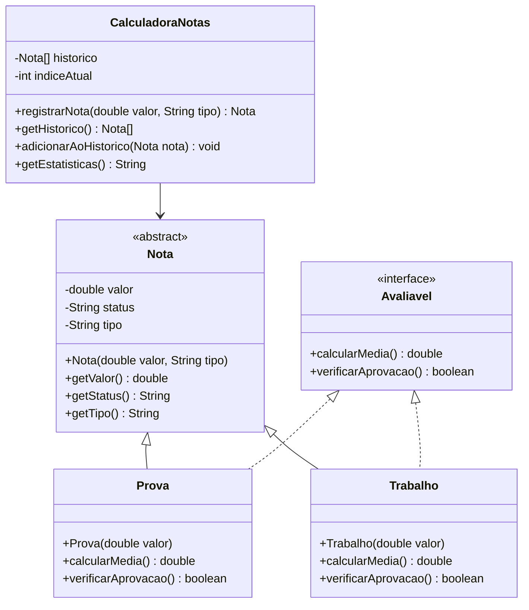

# Projeto Prático II-E: Calculadora de Notas Orientada a Objetos

## Objetivo
Praticar conceitos de Programação Orientada a Objetos (POO) em Java, incluindo Classes, Objetos, Atributos, Métodos, Construtores, Encapsulamento, Herança, Polimorfismo, Classe Abstrata, Interface e Sobrecarga de Métodos.

## Descrição
Desenvolver uma aplicação que:
- Armazene as últimas 10 notas registradas em um vetor de objetos
- Calcule médias e estatísticas usando métodos das classes
- Mantenha histórico das notas inseridas
- Apresente estatísticas das notas
- Utilize herança, polimorfismo, interface, classe abstrata e sobrecarga de métodos para os cálculos

## Funcionalidades
1. **Estrutura de Classes**:
   - Criar uma **classe abstrata** `Nota` com atributos e métodos comuns (valor, status)
   - Implementar **subclasses** para diferentes tipos de avaliação (ex: Prova, Trabalho), cada uma podendo ter regras de aprovação específicas
   - Utilizar **encapsulamento** para proteger os atributos
   - Utilizar **construtores** para inicializar os objetos
   - Definir uma **interface** `Avaliavel` com métodos para calcular status, que será implementada pelas subclasses
   - Implementar **sobrecarga de métodos** para cálculo de média (ex: média simples, média ponderada)

2. **Entrada de Dados**:
   - Receber nota do aluno (0 a 10)
   - Criar objeto correspondente e adicionar ao vetor de histórico

3. **Processamento**:
   - Calcular média das notas
   - Determinar maior e menor nota
   - Contar aprovações/reprovações

4. **Exibição**:
   - Mostrar histórico de notas (objetos)
   - Exibir estatísticas
   - Informar status de cada nota

## Exemplo de uso
```
=== CALCULADORA DE NOTAS (POO) ===
1. Inserir nota
2. Ver histórico
3. Ver estatísticas
4. Sair
Escolha uma opção: 1

[NOVA NOTA]
Digite a nota (0-10): 7.5
Nota registrada!
Status: APROVADO

=== CALCULADORA DE NOTAS (POO) ===
1. Inserir nota
2. Ver histórico
3. Ver estatísticas
4. Sair
Escolha uma opção: 1

[NOVA NOTA]
Digite a nota (0-10): 5.0
Nota registrada!
Status: REPROVADO

=== CALCULADORA DE NOTAS (POO) ===
1. Inserir nota
2. Ver histórico
3. Ver estatísticas
4. Sair
Escolha uma opção: 2

[HISTÓRICO]
1. 7.50 (Aprovado) - Prova
2. 5.00 (Reprovado) - Trabalho

=== CALCULADORA DE NOTAS (POO) ===
1. Inserir nota
2. Ver histórico
3. Ver estatísticas
4. Sair
Escolha uma opção: 3

[ESTATÍSTICAS]
Total de notas: 2
Maior nota: 7.50
Menor nota: 5.00
Média: 6.25
Aprovados: 1 (50%)
Reprovados: 1 (50%)

=== CALCULADORA DE NOTAS (POO) ===
1. Inserir nota
2. Ver histórico
3. Ver estatísticas
4. Sair
Escolha uma opção: 4
Programa finalizado!
```

## Observações
- O vetor armazena apenas as últimas 10 notas (objetos)
- Os valores são armazenados como objetos da classe base `Nota`
- Notas devem estar entre 0 e 10
- Média 7.0 para aprovação
- Utilize todos os conceitos de POO: Classes, Objetos, Atributos, Métodos, Construtores, Herança, Polimorfismo, Encapsulamento, Interface, Classe Abstrata e Sobrecarga de Métodos

## Diagrama UML

> **Sugestão:** O diagrama UML abaixo é apenas uma sugestão de implementação. Você pode estruturar suas classes de outra forma, desde que todos os requisitos do projeto sejam atendidos.



## Explicação do diagrama
O diagrama acima representa:
- `Nota`: Classe abstrata base com atributos e métodos comuns
- `Avaliavel`: Interface que define os métodos de cálculo de média e verificação de aprovação
- Classes concretas: `Prova` e `Trabalho` que herdam de `Nota` e implementam `Avaliavel`
- `CalculadoraNotas`: Classe principal que gerencia as notas e o histórico usando um vetor de tamanho fixo

## Critérios de Avaliação
| Critério                               | Pontos |
|---------------------------------------|--------|
| **Funcionalidade (2.5)**              |        |
| - Implementação dos requisitos        | 1.0    |
| - Correto uso do array               | 1.0    |
| - Precisão nos cálculos              | 0.5    |
| **Qualidade do Código (1.5)**         |        |
| - Organização e clareza              | 0.5    |
| - Comentários e documentação         | 0.5    |
| - Tratamento de erros               | 0.5    |
| **Interface e Usabilidade (1.0)**     |        |
| - Clareza nas mensagens             | 1.0    |
| **Apresentação (5.0)**                |        |
| - Domínio do código                 | 2.0    |
| - Explicação da lógica              | 2.0    |
| - Respostas às perguntas            | 1.0    |
| **Total**                             | 10.0   |

### Observações da Avaliação
- Nota mínima para aprovação: 5.0 pontos
- Trabalhos não apresentados recebem nota zero
- Leitura durante apresentação recebe nota zero
- Membros ausentes recebem nota zero
- Códigos que não executam recebem nota zero
- Cada membro deve apresentar
- A nota da apresentação será individual
- Demonstração prática obrigatória

## Instruções de Entrega
1. **Email**:
   - Para: matheusluis103@gmail.com
   - Assunto: "ETB-LTP1-ProjetoA2-[TURMA][GRUPO]"
   - Até: 30/05, 14:00
   - O remetente do email deve copiar (CC) todos os demais integrantes do grupo.

2. **Conteúdo**:
   - Códigos fonte (.java)
   - Nomes dos integrantes
