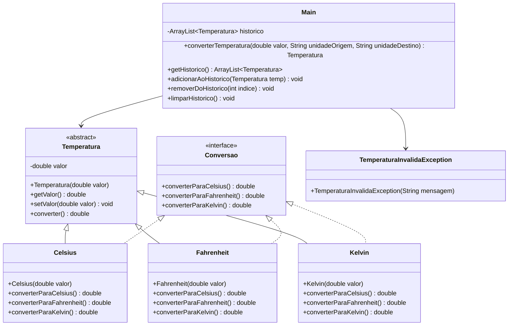

# Projeto Prático III-A: Conversor de Temperatura com POO, ArrayList e Exceções Personalizadas

## Objetivo
Aprimorar os conceitos de Programação Orientada a Objetos (POO) em Java, incluindo o uso de `ArrayList` e seus principais métodos, tratamento de exceções e criação de exceções personalizadas, além dos conceitos já praticados anteriormente (Classes, Objetos, Herança, Polimorfismo, Interface, Classe Abstrata, Sobrecarga de Métodos).

## Descrição
Desenvolver uma aplicação console que:
- Converta temperaturas entre Celsius, Fahrenheit e Kelvin utilizando classes específicas para cada unidade
- Armazene o histórico de conversões em um `ArrayList` de objetos
- Exiba o histórico de conversões e estatísticas
- Utilize herança, polimorfismo, interface, classe abstrata, sobrecarga de métodos, `ArrayList` e tratamento de exceções
- Implemente exceções personalizadas para validação de dados

## Funcionalidades
1. **Estrutura de Classes**:
   - Classe abstrata `Temperatura` com atributos e métodos comuns
   - Subclasses para Celsius, Fahrenheit e Kelvin, cada uma com métodos de conversão específicos
   - Interface `Conversao` com métodos para conversão de temperatura
   - Sobrecarga de métodos para conversão
   - **Uso de `ArrayList<Temperatura>`** para armazenar o histórico de conversões
   - Utilização dos principais métodos do `ArrayList`: `add`, `remove`, `get`, `size`, `clear`, `contains`, etc.
   - **Exceções personalizadas** para validação de valores de temperatura (ex: `TemperaturaInvalidaException`)
   - Tratamento de exceções com `try-catch` e lançamento de exceções personalizadas

2. **Entrada de Dados**:
   - Receber valor numérico e unidade atual
   - Validar os dados lançando exceções personalizadas em caso de valores inválidos
   - Criar objeto correspondente e adicionar ao `ArrayList` de histórico

3. **Seleção de Conversão**:
   - Escolher para qual unidade converter
   - Utilizar polimorfismo e interface para realizar a conversão

4. **Histórico e Estatísticas**:
   - Mostrar histórico de todas as conversões armazenadas no `ArrayList`
   - Permitir remoção de conversões do histórico
   - Exibir estatísticas: total de conversões, menor valor, maior valor, média
   - Permitir limpar todo o histórico usando `clear()`

5. **Tratamento de Exceções**:
   - Utilizar blocos `try-catch` para capturar exceções de entrada e de lógica
   - Lançar exceções personalizadas para valores inválidos
   - Exibir mensagens de erro amigáveis ao usuário

## Exemplo de Uso
```
=== CONVERSOR DE TEMPERATURA (POO/ArrayList) ===
1. Converter temperatura
2. Ver histórico
3. Remover conversão
4. Limpar histórico
5. Ver estatísticas
6. Sair
Escolha uma opção: 1

[CONVERSÃO]
Digite a temperatura: -300
Erro: Temperatura inválida! Valor abaixo do zero absoluto.
Digite a temperatura: 25
Unidade atual (C/F/K): C
Converter para (C/F/K): F
Resultado: 77°F

=== CONVERSOR DE TEMPERATURA (POO/ArrayList) ===
1. Converter temperatura
2. Ver histórico
3. Remover conversão
4. Limpar histórico
5. Ver estatísticas
6. Sair
Escolha uma opção: 2

[HISTÓRICO]
1. 25.00°C -> 77.00°F
2. 37.00°C -> 310.15K

=== CONVERSOR DE TEMPERATURA (POO/ArrayList) ===
1. Converter temperatura
2. Ver histórico
3. Remover conversão
4. Limpar histórico
5. Ver estatísticas
6. Sair
Escolha uma opção: 3

Digite o índice da conversão para remover: 2
Conversão removida com sucesso!

=== CONVERSOR DE TEMPERATURA (POO/ArrayList) ===
1. Converter temperatura
2. Ver histórico
3. Remover conversão
4. Limpar histórico
5. Ver estatísticas
6. Sair
Escolha uma opção: 4

Histórico limpo!

=== CONVERSOR DE TEMPERATURA (POO/ArrayList) ===
1. Converter temperatura
2. Ver histórico
3. Remover conversão
4. Limpar histórico
5. Ver estatísticas
6. Sair
Escolha uma opção: 5

[ESTATÍSTICAS]
Total de conversões: 1
Menor valor: 25.00°C
Maior valor: 25.00°C
Média: 25.00°C

=== CONVERSOR DE TEMPERATURA (POO/ArrayList) ===
1. Converter temperatura
2. Ver histórico
3. Remover conversão
4. Limpar histórico
5. Ver estatísticas
6. Sair
Escolha uma opção: 6
Programa finalizado!
```

## Observações
- O histórico agora é um `ArrayList<Temperatura>`, permitindo tamanho dinâmico
- Utilize os principais métodos do `ArrayList` no código
- Implemente e utilize exceções personalizadas para validação de dados
- Utilize todos os conceitos de POO: Classes, Objetos, Atributos, Métodos, Construtores, Herança, Polimorfismo, Encapsulamento, Interface, Classe Abstrata, Sobrecarga de Métodos, Coleções e Exceções

## Critérios de Avaliação
| Critério                               | Pontos |
|---------------------------------------|--------|
| **Funcionalidade (2.5)**              |        |
| - Implementação dos requisitos        | 1.0    |
| - Uso correto do ArrayList           | 1.0    |
| - Precisão nos cálculos              | 0.5    |
| **Qualidade do Código (2.0)**         |        |
| - Organização e clareza              | 0.5    |
| - Comentários e documentação         | 0.5    |
| - Tratamento de erros e exceções     | 1.0    |
| **Interface e Usabilidade (1.0)**     |        |
| - Clareza nas mensagens              | 1.0    |
| **Apresentação (4.5)**                |        |
| - Domínio do código                  | 2.0    |
| - Explicação da lógica               | 2.0    |
| - Respostas às perguntas             | 0.5    |
| **Total**                             | 10.0   |

### Observações da Avaliação
- Nota mínima para aprovação: 5.0 pontos
- Trabalhos não apresentados recebem nota zero
- Leitura durante apresentação recebe nota zero
- Membros ausentes recebem nota zero
- Códigos que não executam recebem nota zero
- Cada membro deve apresentar
- A nota da apresentação será individual
- Demonstração prática obrigatória

## Instruções de Entrega
1. **Email**:
   - Para: matheusluis103@gmail.com
   - Assunto: "ETB-LTP1-ProjetoA3-[TURMA][GRUPO]"
   - Até: 25/06, 14:00
   - O remetente do email deve copiar (CC) todos os demais integrantes do grupo.

2. **Conteúdo**:
   - Códigos fonte (.java)
   - Nomes dos integrantes

## Diagrama UML


O diagrama acima representa:
- `Temperatura`: Classe abstrata base com atributos e métodos comuns
- `Conversao`: Interface para métodos de conversão
- Classes concretas: `Celsius`, `Fahrenheit` e `Kelvin` que herdam de `Temperatura` e implementam `Conversao`
- `TemperaturaInvalidaException`: Exceção personalizada para validação de valores
- `Main`: Classe principal que gerencia as conversões e o histórico usando um `ArrayList` e tratamento de exceções
