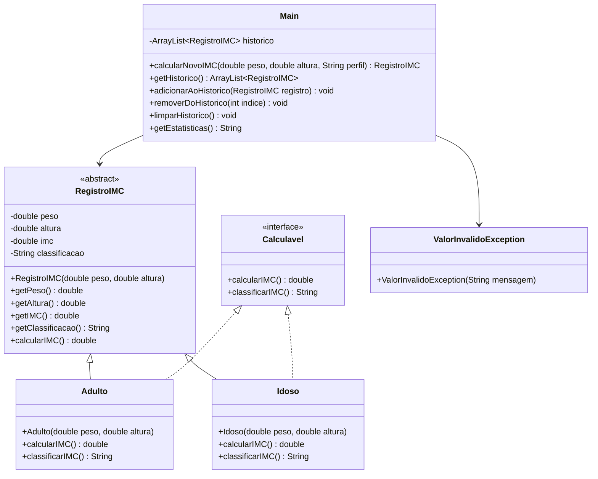

# Projeto Prático III-B: Calculadora de IMC com ArrayList e Exceções Personalizadas

## Objetivo
Aprimorar os conceitos de Programação Orientada a Objetos (POO) em Java, incluindo o uso de `ArrayList` e seus principais métodos, tratamento de exceções e criação de exceções personalizadas, além dos conceitos já praticados anteriormente (Classes, Objetos, Herança, Polimorfismo, Interface, Classe Abstrata, Sobrecarga de Métodos).

## Descrição
Desenvolver uma aplicação console que:
- Calcule o IMC de várias pessoas utilizando classes específicas
- Armazene os dados das pessoas em um `ArrayList` de objetos
- Mostre resultados sequencialmente e exiba histórico e estatísticas
- Utilize herança, polimorfismo, interface, classe abstrata, sobrecarga de métodos, `ArrayList` e tratamento de exceções
- Implemente exceções personalizadas para validação de dados

## Funcionalidades
1. **Estrutura de Classes**:
   - Classe abstrata `RegistroIMC` com atributos e métodos comuns (peso, altura, IMC, classificação)
   - Subclasses para diferentes perfis (ex: Adulto, Idoso), cada uma com regras de classificação específicas
   - Interface `Calculavel` com métodos para cálculo e classificação do IMC
   - Sobrecarga de métodos para cálculo do IMC
   - **Uso de `ArrayList<RegistroIMC>`** para armazenar o histórico de registros
   - Utilização dos principais métodos do `ArrayList`: `add`, `remove`, `get`, `size`, `clear`, `contains`, etc.
   - **Exceções personalizadas** para validação de peso e altura (ex: `ValorInvalidoException`)
   - Tratamento de exceções com `try-catch` e lançamento de exceções personalizadas

2. **Entrada de Dados**:
   - Receber peso e altura do usuário
   - Validar os dados lançando exceções personalizadas em caso de valores inválidos
   - Criar objeto correspondente e adicionar ao `ArrayList` de histórico

3. **Cálculo e Exibição**:
   - Calcular IMC e classificação utilizando polimorfismo e interface
   - Exibir resultado formatado

4. **Histórico e Estatísticas**:
   - Mostrar histórico de todos os registros armazenados no `ArrayList`
   - Permitir remoção de registros do histórico
   - Exibir estatísticas: total de registros, menor IMC, maior IMC, média
   - Permitir limpar todo o histórico usando `clear()`

5. **Tratamento de Exceções**:
   - Utilizar blocos `try-catch` para capturar exceções de entrada e de lógica
   - Lançar exceções personalizadas para valores inválidos
   - Exibir mensagens de erro amigáveis ao usuário

## Exemplo de Uso
```
=== CALCULADORA DE IMC (POO/ArrayList) ===
1. Calcular novo IMC
2. Mostrar histórico
3. Remover registro
4. Limpar histórico
5. Ver estatísticas
6. Sair
Escolha uma opção: 1

[CÁLCULO DE IMC]
Digite o peso (kg): -70
Erro: Peso inválido! O peso deve ser positivo.
Digite o peso (kg): 70
Digite a altura (m): 0
Erro: Altura inválida! A altura deve ser maior que zero.
Digite a altura (m): 1.75
Perfil (A)dulto/(I)doso: A

Resultado:
IMC: 22.86
Classificação: Peso Normal

=== CALCULADORA DE IMC (POO/ArrayList) ===
1. Calcular novo IMC
2. Mostrar histórico
3. Remover registro
4. Limpar histórico
5. Ver estatísticas
6. Sair
Escolha uma opção: 2

[HISTÓRICO]
1. IMC: 22.86 (Normal) - Adulto
2. IMC: 29.38 (Sobrepeso) - Idoso

=== CALCULADORA DE IMC (POO/ArrayList) ===
1. Calcular novo IMC
2. Mostrar histórico
3. Remover registro
4. Limpar histórico
5. Ver estatísticas
6. Sair
Escolha uma opção: 3

Digite o índice do registro para remover: 2
Registro removido com sucesso!

=== CALCULADORA DE IMC (POO/ArrayList) ===
1. Calcular novo IMC
2. Mostrar histórico
3. Remover registro
4. Limpar histórico
5. Ver estatísticas
6. Sair
Escolha uma opção: 4

Histórico limpo!

=== CALCULADORA DE IMC (POO/ArrayList) ===
1. Calcular novo IMC
2. Mostrar histórico
3. Remover registro
4. Limpar histórico
5. Ver estatísticas
6. Sair
Escolha uma opção: 5

[ESTATÍSTICAS]
Total de registros: 1
Menor IMC: 22.86
Maior IMC: 22.86
Média: 22.86

=== CALCULADORA DE IMC (POO/ArrayList) ===
1. Calcular novo IMC
2. Mostrar histórico
3. Remover registro
4. Limpar histórico
5. Ver estatísticas
6. Sair
Escolha uma opção: 6
Programa finalizado!
```

## Observações
- O histórico agora é um `ArrayList<RegistroIMC>`, permitindo tamanho dinâmico
- Utilize os principais métodos do `ArrayList` no código
- Implemente e utilize exceções personalizadas para validação de dados
- Utilize todos os conceitos de POO: Classes, Objetos, Atributos, Métodos, Construtores, Herança, Polimorfismo, Encapsulamento, Interface, Classe Abstrata, Sobrecarga de Métodos, Coleções e Exceções

## Critérios de Avaliação
| Critério                               | Pontos |
|---------------------------------------|--------|
| **Funcionalidade (2.5)**              |        |
| - Implementação dos requisitos        | 1.0    |
| - Uso correto do ArrayList           | 1.0    |
| - Precisão nos cálculos              | 0.5    |
| **Qualidade do Código (2.0)**         |        |
| - Organização e clareza              | 0.5    |
| - Comentários e documentação         | 0.5    |
| - Tratamento de erros e exceções     | 1.0    |
| **Interface e Usabilidade (1.0)**     |        |
| - Clareza nas mensagens              | 1.0    |
| **Apresentação (4.5)**                |        |
| - Domínio do código                  | 2.0    |
| - Explicação da lógica               | 2.0    |
| - Respostas às perguntas             | 0.5    |
| **Total**                             | 10.0   |

### Observações da Avaliação
- Trabalhos não apresentados recebem nota zero
- Leitura durante apresentação recebe nota zero
- Membros ausentes recebem nota zero
- Códigos que não executam recebem nota zero
- Cada membro deve apresentar
- A nota da apresentação será individual
- Demonstração prática obrigatória

## Instruções de Entrega
1. **Email**:
   - Para: matheusluis103@gmail.com
   - Assunto: "ETB-LTP1-ProjetoA3-[TURMA][GRUPO]"
   - Até: 25/06, 14:00
   - O remetente do email deve copiar (CC) todos os demais integrantes do grupo.

2. **Conteúdo**:
   - Códigos fonte (.java)
   - Nomes dos integrantes

## Diagrama UML
> **Sugestão:** O diagrama UML abaixo é apenas uma sugestão de implementação. Você pode estruturar suas classes de outra forma, desde que todos os requisitos do projeto sejam atendidos.


O diagrama acima representa:
- `RegistroIMC`: Classe abstrata base com atributos e métodos comuns
- `Calculavel`: Interface para cálculo e classificação
- Classes concretas: `Adulto` e `Idoso` que herdam de `RegistroIMC` e implementam `Calculavel`
- `ValorInvalidoException`: Exceção personalizada para validação de dados
- `Main`: Classe principal que gerencia os cálculos e o histórico usando um `ArrayList` e tratamento de exceções
