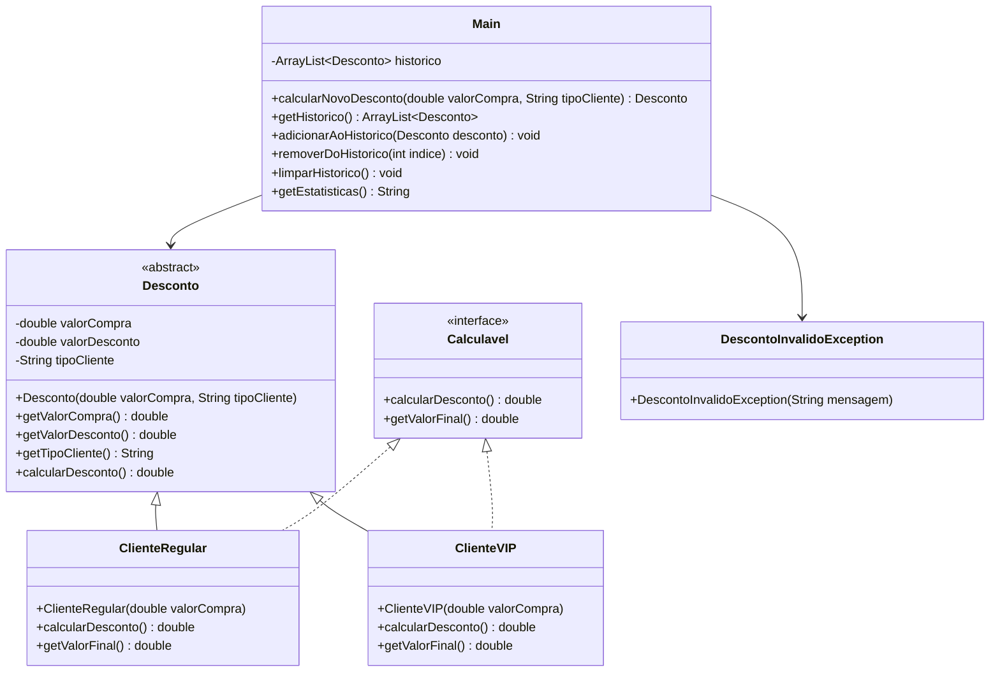

# Projeto Prático III-D: Calculadora de Descontos com POO, ArrayList e Exceções Personalizadas

## Objetivo
Aprimorar os conceitos de Programação Orientada a Objetos (POO) em Java, incluindo o uso de `ArrayList` e seus principais métodos, tratamento de exceções e criação de exceções personalizadas, além dos conceitos já praticados anteriormente (Classes, Objetos, Herança, Polimorfismo, Interface, Classe Abstrata, Sobrecarga de Métodos).

## Descrição
Desenvolver uma aplicação que:
- Use um `ArrayList` de objetos para armazenar os descontos aplicados
- Calcule descontos baseados no valor da compra e tipo de cliente usando classes e objetos
- Mantenha histórico das operações
- Exiba estatísticas dos descontos
- Utilize herança, polimorfismo, interface, classe abstrata, sobrecarga de métodos, `ArrayList` e tratamento de exceções
- Implemente exceções personalizadas para validação de valores

## Funcionalidades
1. **Estrutura de Classes**:
   - Classe abstrata `Desconto` com atributos e métodos comuns (valorCompra, desconto, tipoCliente)
   - Subclasses para diferentes tipos de cliente (Regular, VIP), cada uma com regras de desconto específicas
   - Interface `Calculavel` com métodos para calcular desconto
   - Sobrecarga de métodos para cálculo do desconto
   - **Uso de `ArrayList<Desconto>`** para armazenar o histórico
   - Utilização dos principais métodos do `ArrayList`: `add`, `remove`, `get`, `size`, `clear`, `contains`, etc.
   - **Exceções personalizadas** para validação de valores (ex: `DescontoInvalidoException`)
   - Tratamento de exceções com `try-catch` e lançamento de exceções personalizadas

2. **Entrada de Dados**:
   - Valor da compra
   - Tipo de cliente (Regular/VIP)
   - Validar os dados lançando exceções personalizadas em caso de valores inválidos
   - Criar objeto correspondente e adicionar ao `ArrayList` de histórico

3. **Processamento**:
   - Calcular valor do desconto e valor final usando métodos das classes
   - Armazenar no histórico

4. **Exibição**:
   - Mostrar resultado atual
   - Exibir histórico de descontos (objetos)
   - Apresentar estatísticas
   - Permitir remoção de descontos do histórico
   - Permitir limpar todo o histórico usando `clear()`

5. **Tratamento de Exceções**:
   - Utilizar blocos `try-catch` para capturar exceções de entrada e de lógica
   - Lançar exceções personalizadas para valores inválidos
   - Exibir mensagens de erro amigáveis ao usuário

## Exemplo de Uso
```
=== CALCULADORA DE DESCONTOS (POO/ArrayList) ===
1. Calcular desconto
2. Ver histórico
3. Remover desconto
4. Limpar histórico
5. Ver estatísticas
6. Sair
Escolha uma opção: 1

[NOVA COMPRA]
Valor da compra: -100.00
Erro: Valor da compra inválido!
Valor da compra: 100.00
Tipo de cliente (R/V): V

[RESULTADO]
Valor original: R$ 100.00
Desconto (10%): R$ 10.00
Valor final: R$ 90.00

=== CALCULADORA DE DESCONTOS (POO/ArrayList) ===
1. Calcular desconto
2. Ver histórico
3. Remover desconto
4. Limpar histórico
5. Ver estatísticas
6. Sair
Escolha uma opção: 2

[HISTÓRICO]
1. R$ 10.00 (VIP)
2. R$ 25.00 (Regular)
3. R$ 150.00 (VIP)

=== CALCULADORA DE DESCONTOS (POO/ArrayList) ===
1. Calcular desconto
2. Ver histórico
3. Remover desconto
4. Limpar histórico
5. Ver estatísticas
6. Sair
Escolha uma opção: 3

Digite o índice do desconto para remover: 2
Desconto removido com sucesso!

=== CALCULADORA DE DESCONTOS (POO/ArrayList) ===
1. Calcular desconto
2. Ver histórico
3. Remover desconto
4. Limpar histórico
5. Ver estatísticas
6. Sair
Escolha uma opção: 4

Histórico limpo!

=== CALCULADORA DE DESCONTOS (POO/ArrayList) ===
1. Calcular desconto
2. Ver histórico
3. Remover desconto
4. Limpar histórico
5. Ver estatísticas
6. Sair
Escolha uma opção: 5

[ESTATÍSTICAS]
Total descontos: R$ 185.00
Maior desconto: R$ 150.00
Menor desconto: R$ 10.00
Média: R$ 61.67

=== CALCULADORA DE DESCONTOS (POO/ArrayList) ===
1. Calcular desconto
2. Ver histórico
3. Remover desconto
4. Limpar histórico
5. Ver estatísticas
6. Sair
Escolha uma opção: 6
Programa finalizado!
```

## Observações
- O histórico agora é um `ArrayList<Desconto>`, permitindo tamanho dinâmico
- Utilize os principais métodos do `ArrayList` no código
- Implemente e utilize exceções personalizadas para validação de dados
- Utilize todos os conceitos de POO: Classes, Objetos, Atributos, Métodos, Construtores, Herança, Polimorfismo, Encapsulamento, Interface, Classe Abstrata, Sobrecarga de Métodos, Coleções e Exceções

## Critérios de Avaliação
| Critério                               | Pontos |
|---------------------------------------|--------|
| **Funcionalidade (2.5)**              |        |
| - Implementação dos requisitos        | 1.0    |
| - Uso correto do ArrayList           | 1.0    |
| - Precisão nos cálculos              | 0.5    |
| **Qualidade do Código (2.0)**         |        |
| - Organização e clareza              | 0.5    |
| - Comentários e documentação         | 0.5    |
| - Tratamento de erros e exceções     | 1.0    |
| **Interface e Usabilidade (1.0)**     |        |
| - Clareza nas mensagens              | 1.0    |
| **Apresentação (4.5)**                |        |
| - Domínio do código                  | 2.0    |
| - Explicação da lógica               | 2.0    |
| - Respostas às perguntas             | 0.5    |
| **Total**                             | 10.0   |

### Observações da Avaliação
- Nota mínima para aprovação: 5.0 pontos
- Trabalhos não apresentados recebem nota zero
- Leitura durante apresentação recebe nota zero
- Membros ausentes recebem nota zero
- Códigos que não executam recebem nota zero
- Cada membro deve apresentar
- A nota da apresentação será individual
- Demonstração prática obrigatória

## Instruções de Entrega
1. **Email**:
   - Para: matheusluis103@gmail.com
   - Assunto: "ETB-LTP1-ProjetoA3-[TURMA][GRUPO]"
   - Até: 25/06, 14:00
   - O remetente do email deve copiar (CC) todos os demais integrantes do grupo.

2. **Conteúdo**:
   - Códigos fonte (.java)
   - Nomes dos integrantes

## Diagrama UML


O diagrama acima representa:
- `Desconto`: Classe abstrata base com atributos e métodos comuns
- `Calculavel`: Interface para métodos de cálculo de desconto
- Classes concretas: `ClienteRegular` e `ClienteVIP` que herdam de `Desconto` e implementam `Calculavel`
- `DescontoInvalidoException`: Exceção personalizada para validação de valores
- `Main`: Classe principal que gerencia os cálculos e o histórico usando um `ArrayList` e tratamento de exceções
