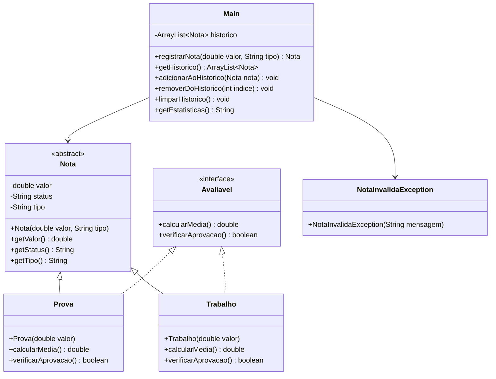

# Projeto Prático III-E: Calculadora de Notas com POO, ArrayList e Exceções Personalizadas

## Objetivo
Aprimorar os conceitos de Programação Orientada a Objetos (POO) em Java, incluindo o uso de `ArrayList` e seus principais métodos, tratamento de exceções e criação de exceções personalizadas, além dos conceitos já praticados anteriormente (Classes, Objetos, Herança, Polimorfismo, Interface, Classe Abstrata, Sobrecarga de Métodos).

## Descrição
Desenvolver uma aplicação que:
- Armazene as notas registradas em um `ArrayList` de objetos
- Calcule médias e estatísticas usando métodos das classes
- Mantenha histórico das notas inseridas
- Apresente estatísticas das notas
- Utilize herança, polimorfismo, interface, classe abstrata, sobrecarga de métodos, `ArrayList` e tratamento de exceções
- Implemente exceções personalizadas para validação de notas

## Funcionalidades
1. **Estrutura de Classes**:
   - Classe abstrata `Nota` com atributos e métodos comuns (valor, status, tipo)
   - Subclasses para diferentes tipos de avaliação (ex: Prova, Trabalho), cada uma podendo ter regras de aprovação específicas
   - Interface `Avaliavel` com métodos para calcular status
   - Sobrecarga de métodos para cálculo de média
   - **Uso de `ArrayList<Nota>`** para armazenar o histórico
   - Utilização dos principais métodos do `ArrayList`: `add`, `remove`, `get`, `size`, `clear`, `contains`, etc.
   - **Exceções personalizadas** para validação de notas (ex: `NotaInvalidaException`)
   - Tratamento de exceções com `try-catch` e lançamento de exceções personalizadas

2. **Entrada de Dados**:
   - Receber nota do aluno (0 a 10)
   - Validar os dados lançando exceções personalizadas em caso de valores inválidos
   - Criar objeto correspondente e adicionar ao `ArrayList` de histórico

3. **Processamento**:
   - Calcular média das notas
   - Determinar maior e menor nota
   - Contar aprovações/reprovações

4. **Exibição**:
   - Mostrar histórico de todas as notas armazenadas no `ArrayList`
   - Permitir remoção de notas do histórico
   - Exibir estatísticas
   - Informar status de cada nota
   - Permitir limpar todo o histórico usando `clear()`

5. **Tratamento de Exceções**:
   - Utilizar blocos `try-catch` para capturar exceções de entrada e de lógica
   - Lançar exceções personalizadas para valores inválidos
   - Exibir mensagens de erro amigáveis ao usuário

## Exemplo de Uso
```
=== CALCULADORA DE NOTAS (POO/ArrayList) ===
1. Inserir nota
2. Ver histórico
3. Remover nota
4. Limpar histórico
5. Ver estatísticas
6. Sair
Escolha uma opção: 1

[NOVA NOTA]
Digite a nota (0-10): 11
Erro: Nota inválida! Deve estar entre 0 e 10.
Digite a nota (0-10): 7.5
Nota registrada!
Status: APROVADO

=== CALCULADORA DE NOTAS (POO/ArrayList) ===
1. Inserir nota
2. Ver histórico
3. Remover nota
4. Limpar histórico
5. Ver estatísticas
6. Sair
Escolha uma opção: 2

[HISTÓRICO]
1. 7.50 (Aprovado) - Prova
2. 5.00 (Reprovado) - Trabalho

=== CALCULADORA DE NOTAS (POO/ArrayList) ===
1. Inserir nota
2. Ver histórico
3. Remover nota
4. Limpar histórico
5. Ver estatísticas
6. Sair
Escolha uma opção: 3

Digite o índice da nota para remover: 2
Nota removida com sucesso!

=== CALCULADORA DE NOTAS (POO/ArrayList) ===
1. Inserir nota
2. Ver histórico
3. Remover nota
4. Limpar histórico
5. Ver estatísticas
6. Sair
Escolha uma opção: 4

Histórico limpo!

=== CALCULADORA DE NOTAS (POO/ArrayList) ===
1. Inserir nota
2. Ver histórico
3. Remover nota
4. Limpar histórico
5. Ver estatísticas
6. Sair
Escolha uma opção: 5

[ESTATÍSTICAS]
Total de notas: 1
Maior nota: 7.50
Menor nota: 7.50
Média: 7.50
Aprovados: 1 (100%)
Reprovados: 0 (0%)

=== CALCULADORA DE NOTAS (POO/ArrayList) ===
1. Inserir nota
2. Ver histórico
3. Remover nota
4. Limpar histórico
5. Ver estatísticas
6. Sair
Escolha uma opção: 6
Programa finalizado!
```

## Observações
- O histórico agora é um `ArrayList<Nota>`, permitindo tamanho dinâmico
- Utilize os principais métodos do `ArrayList` no código
- Implemente e utilize exceções personalizadas para validação de dados
- Utilize todos os conceitos de POO: Classes, Objetos, Atributos, Métodos, Construtores, Herança, Polimorfismo, Encapsulamento, Interface, Classe Abstrata, Sobrecarga de Métodos, Coleções e Exceções

## Critérios de Avaliação
| Critério                               | Pontos |
|---------------------------------------|--------|
| **Funcionalidade (2.5)**              |        |
| - Implementação dos requisitos        | 1.0    |
| - Uso correto do ArrayList           | 1.0    |
| - Precisão nos cálculos              | 0.5    |
| **Qualidade do Código (2.0)**         |        |
| - Organização e clareza              | 0.5    |
| - Comentários e documentação         | 0.5    |
| - Tratamento de erros e exceções     | 1.0    |
| **Interface e Usabilidade (1.0)**     |        |
| - Clareza nas mensagens              | 1.0    |
| **Apresentação (4.5)**                |        |
| - Domínio do código                  | 2.0    |
| - Explicação da lógica               | 2.0    |
| - Respostas às perguntas             | 0.5    |
| **Total**                             | 10.0   |

### Observações da Avaliação
- Nota mínima para aprovação: 5.0 pontos
- Trabalhos não apresentados recebem nota zero
- Leitura durante apresentação recebe nota zero
- Membros ausentes recebem nota zero
- Códigos que não executam recebem nota zero
- Cada membro deve apresentar
- A nota da apresentação será individual
- Demonstração prática obrigatória

## Instruções de Entrega
1. **Email**:
   - Para: matheusluis103@gmail.com
   - Assunto: "ETB-LTP1-ProjetoA3-[TURMA][GRUPO]"
   - Até: 25/06, 14:00
   - O remetente do email deve copiar (CC) todos os demais integrantes do grupo.

2. **Conteúdo**:
   - Códigos fonte (.java)
   - Nomes dos integrantes

## Diagrama UML


O diagrama acima representa:
- `Nota`: Classe abstrata base com atributos e métodos comuns
- `Avaliavel`: Interface para métodos de cálculo de média e verificação de aprovação
- Classes concretas: `Prova` e `Trabalho` que herdam de `Nota` e implementam `Avaliavel`
- `NotaInvalidaException`: Exceção personalizada para validação de notas
- `Main`: Classe principal que gerencia as notas e o histórico usando um `ArrayList` e tratamento de exceções
